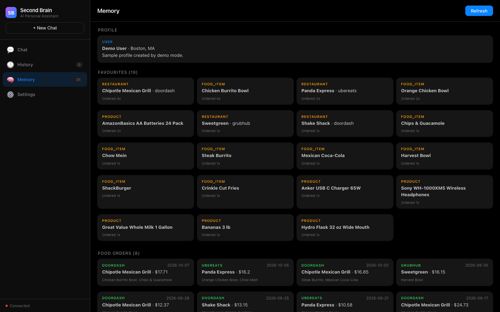
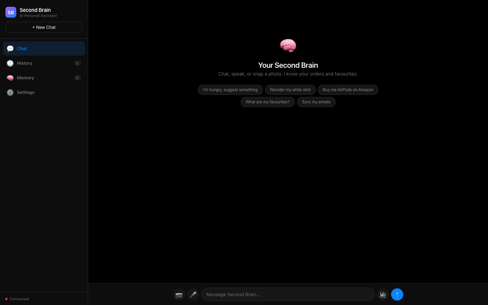
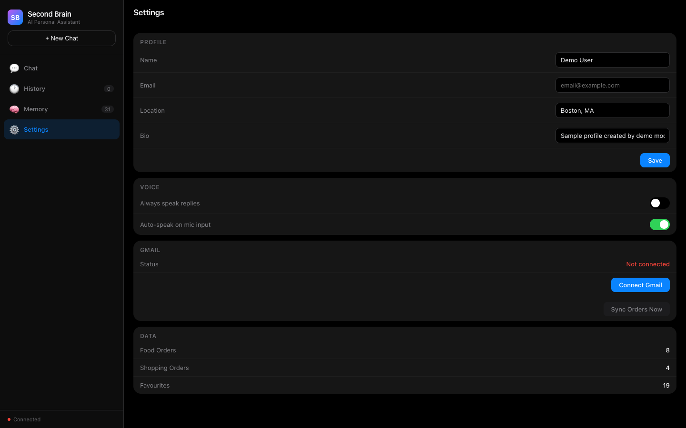

# Agentic Second Brain

[](https://github.com/sandeepvijayarao09/AI-Agentic-Mar28/actions/workflows/ci.yml)

A personal assistant that reads your order-confirmation emails, turns them into a structured memory of what you eat and buy, and routes your requests to Gemini agents that can act on it.



*The Memory page running in demo mode (`DEMO_MODE=1`), showing synthetic orders. No Gmail account is connected.*

Built at the Multimodal Frontier Hackathon, 28-29 March 2026.

## Highlights

- **Gmail to SQLite pipeline.** OAuth into Gmail, search for DoorDash, Uber Eats, Grubhub, Instacart, Amazon, Walmart and Target receipts, and parse each one into order ID, date, merchant, line items and total ([`order_parser.py`](api/services/order_parser.py)). Regex first, with a Gemini fallback for emails the regex can't read.
- **Master agent with sub-agents on Google ADK.** A routing step picks one or more of five sub-agents (Food, Shopping, Email, Profile, General), chains them when a request needs two (for example "order my usual" goes Profile, then Food), and a Verifier agent checks the answer before it's returned ([`brain.py`](api/agents/brain.py)). The sub-agents share 15 tools ([`tools.py`](api/agents/tools.py)).
- **Favourites from order history.** Restaurants, food items and products are ranked by how often they appear in your orders, and recomputed by a daily validator.
- **Photo to product.** `POST /identify` sends an image to Gemini twice (identify, then refine the search query) and returns an Amazon search link.
- **Optional browser automation.** With `ENABLE_BROWSER_AUTOMATION=1`, the Shopping and Food agents open a visible Chromium window through Playwright and search Amazon or DoorDash for you. It's off by default; otherwise the agents return search links.
- **Two UIs.** A single-page UI served by FastAPI at `/` (chat with voice input/output and photo upload, history, memory, settings), and a minimal Next.js chat client in `frontend/`.

## Demo data and honesty notes

- The hackathon demo ran against a real Gmail inbox, but the order emails in it were sample confirmations I sent to myself, not real purchases. One of the Gmail search queries in [`sync.py`](api/services/sync.py) exists only to catch those.
- `DEMO_MODE=1` seeds the database with synthetic receipts (see [`api/demo.py`](api/demo.py)). They go through the same parser and favourites code as real email.
- Chat, photo identification and the Gemini parsing fallback all need a `GEMINI_API_KEY`. Without one, the Memory, History and Settings pages and the order endpoints still work.
- The project started on Railtracks and was migrated to Google ADK during the hackathon (commit `c9a00ac`). The code no longer uses Railtracks.
- An earlier v0 of this idea was a Next.js app built at the Google DeepMind hackathon on 21 March 2026. That repo is private.

## Screenshots

| Chat | Settings |
|---|---|
|  |  |

Captured with headless Chrome against the local backend in demo mode.

## Architecture

```
Browser UI (api/static)  or  Next.js chat (frontend/)
                │  POST /chat
┌───────────────▼──────────────────────────────────────────┐
│ FastAPI                                                   │
│  Master: plan → deploy sub-agent(s) → chain → verify      │
│   ├── FoodAgent      (4 tools)                            │
│   ├── ShoppingAgent  (5 tools)                            │
│   ├── EmailAgent     (3 tools)       Google ADK + Gemini  │
│   ├── ProfileAgent   (3 tools)       2.5 Flash Lite       │
│   ├── GeneralAgent                                        │
│   └── VerifierAgent                                       │
│                                                           │
│  Scheduled: EmailSyncAgent, FavouritesValidator           │
│                                                           │
│  SQLite: food_orders, shopping, user_favourites,          │
│          user_bio, chat sessions        ◄── Gmail API     │
└───────────────────────────────────────────────────────────┘
```

## Tech stack

- **Backend:** Python 3.12, FastAPI, SQLAlchemy, SQLite
- **Agents:** Google ADK (`google-adk`), Gemini 2.5 Flash Lite via `google-genai`
- **Email:** Gmail API with OAuth 2.0
- **Browser automation (optional):** Playwright
- **Frontend:** single-file HTML/JS UI, plus Next.js 16 and React 19
- **Optional:** Unkey API-key verification middleware (enabled when `UNKEY_ROOT_KEY` is set)

## Quick start

### Try it without Gmail (demo mode)

```bash
git clone https://github.com/sandeepvijayarao09/AI-Agentic-Mar28.git
cd AI-Agentic-Mar28
python3.12 -m venv .venv && source .venv/bin/activate
pip install -r requirements.txt
DEMO_MODE=1 uvicorn api.main:app --port 8080
```

Open http://localhost:8080 and go to Memory. To reseed at any time, run `python scripts/seed_demo.py`.

### Full setup

1. `cp .env.example .env` and fill in:
   - `GEMINI_API_KEY` for chat, photo identification and the parsing fallback.
   - `GOOGLE_CLIENT_ID` / `GOOGLE_CLIENT_SECRET` from a Google Cloud OAuth client with the Gmail API enabled and `http://localhost:8080/auth/gmail/callback` as a redirect URI.
2. Start the backend: `uvicorn api.main:app --port 8080 --reload`
3. Connect Gmail: open http://localhost:8080/auth/gmail/authorize
4. Sync orders: click **Sync Orders Now** in Settings, or `curl -X POST http://localhost:8080/sync/gmail`
5. Optional browser automation: `playwright install chromium`, then set `ENABLE_BROWSER_AUTOMATION=1`.

### Next.js client (optional)

```bash
cd frontend
npm ci
npm run dev   # http://localhost:3000, proxies /api/* to the backend on :8080
```

## Tests

```bash
pip install -r requirements-dev.txt
python -m pytest
```

The suite covers the order parser against synthetic DoorDash, Uber Eats, Grubhub, Amazon and Walmart receipts, Gmail message parsing, the Gmail-to-SQLite sync (with the Gmail API stubbed), favourites ranking, demo seeding and intent routing. It makes no network or Gemini calls. CI also type-checks and builds the Next.js frontend.

## API

| Method | Path | Needs |
|--------|------|-------|
| POST | `/chat` | Gemini key |
| POST | `/identify` | Gemini key |
| GET | `/memory` | – |
| GET | `/sync/stats` | – |
| POST | `/sync/gmail` | Gmail OAuth |
| GET / PUT | `/bio` | – |
| GET / POST / DELETE | `/history/sessions[/{id}]` | – |
| GET | `/agents/status` | – |
| POST | `/agents/validate` | – |
| POST | `/agents/sync`, `/agents/daily` | Gemini key + Gmail OAuth |
| GET | `/auth/gmail/authorize`, `/auth/gmail/status` | – |
| GET | `/api/health` | – |

## Deployment

`.do/app.yaml` and `Procfile` target DigitalOcean App Platform. There's no live deployment right now.

## Project layout

```
api/
  main.py            FastAPI app, demo-mode seeding, static UI mount
  demo.py            synthetic receipts for demo mode
  agents/            brain.py (master + sub-agents), tools.py, scheduled.py
  services/          order_parser.py, sync.py, gmail.py, autonomous_shop.py
  routes/            chat, memory, history, bio, sync, gmail, vision, agents
  models/            SQLAlchemy models
  static/index.html  main UI
frontend/            Next.js chat client
scripts/seed_demo.py
tests/
```

## License

MIT
